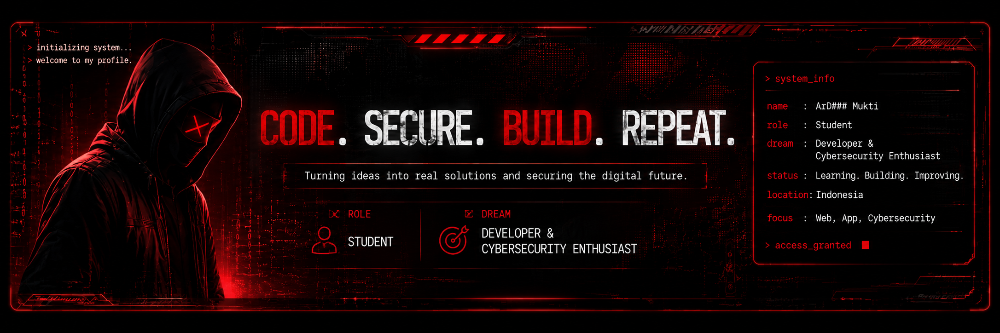

  

---

## Hi everyone! 👋

My name is **ArD Mukti**, and I'm a **student** from **Indonesia** who has a deep passion for technology, programming, and cybersecurity.

Ever since I wrote my first lines of code, I realized that software development is more than creating applications—it's about solving problems, building ideas into reality, and continuously improving through experience.

My biggest dream is to become a **Developer** and **Cybersecurity Enthusiast**, someone who can create modern applications while contributing to a safer digital world. Although I'm still learning, I believe that consistency, curiosity, and determination are the keys to becoming better every day.

Currently, I'm spending my time learning **Web Development**, **Application Development**, **Software Engineering**, and **Cybersecurity Fundamentals**. Every project I build helps me gain new knowledge, improve my skills, and move one step closer to achieving my goals.

This GitHub profile is my personal workspace where I share projects, document my learning journey, experiment with new technologies, and continue growing one commit at a time.

Thank you for visiting my profile. I hope you enjoy my work, and I look forward to building amazing things in the future.

---

### 🚀 Current Journey

| | |
|:--|:--|
| 👤 **Name** | ArD Mukti |
| 🎓 **Role** | Student |
| 🎯 **Dream** | Developer & Cybersecurity Enthusiast |
| 🌍 **Country** | Indonesia |
| 📖 **Learning** | Web Development, App Development & Cybersecurity |
| 💡 **Status** | Learning • Building • Improving |

---

## 💻 Technologies & Tools

---

## 📊 GitHub Statistics

---

## 🎯 My Goals

🌐 Become a Professional Developer

🔐 Learn Cybersecurity and Ethical Hacking

📱 Build Modern Applications

🚀 Contribute to Open Source

📚 Never Stop Learning

💡 Create Technology That Makes an Impact

---

## 📚 Currently Learning

HTML • CSS • JavaScript

PHP • Python

Git & GitHub

Linux

Cybersecurity Fundamentals

Networking

---

## 💭 Personal Motto

> **"Every expert was once a beginner. Every line of code brings me one step closer to the future I dream of."**

---

---

### Thanks for visiting my profile ❤️

**Code • Learn • Secure • Build**

